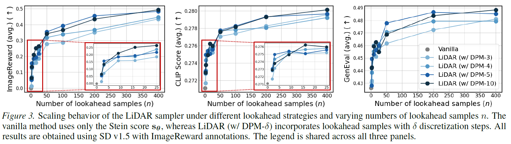
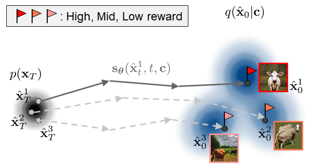
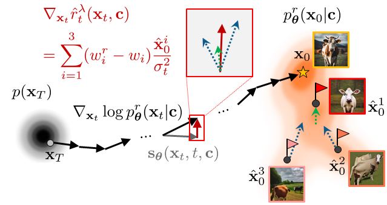

# Diffusion-LiDAR-Sampling (ICML 2026 Spotlight) 
**Official repo for Lookahead Sample Reward Guidance for Test-Time Scaling of Diffusion Models (LiDAR, Under review)**

**Authors: [Yeongmin Kim](https://sites.google.com/view/yeongmin-space/), Donghyeok Shin, Byeonghu Na, Minsang Park, Richard Lee Kim, and Il-Chul Moon**   

**Resources: [paper](https://arxiv.org/pdf/2602.03211)**  <br>

**ToDo: Add SDXL/FLUX backbones**

## Overview
Lookahead Sample Reward Guidance (LiDAR) is a test-time scaling method for diffusion model reward alignment. The performance increases with:
1. Higher lookahead accuracy (`num_inference_steps` $\uparrow$ in phase 1)
2. More lookahead samples (`num_particles` $\uparrow$ in phase 1)




### Phase 1) Lookahead sampling and reward annotation
```
python lookahead_sampling.py --seed=100 --num_particles=50 --num_inference_steps=5 --save_individual_images=True
```

### Phase 2) LiDAR sampling for target reward-tilted distribution
```
python LiDAR_sampling.py --use_rag --scale=12.5 --resample_t_end=200 --lookahead_path=100_50_5 --save_individual_images
```


## Acknowledgements
This codebase builds upon and is inspired by:
- **Diffusers**: https://github.com/huggingface/diffusers
- **ImageReward**: https://github.com/THUDM/ImageReward
- **FK-Diffusion-Steering**: https://github.com/zacharyhorvitz/Fk-Diffusion-Steering
- **DATE**: https://github.com/aailab-kaist/DATE


## Citation
```bib
@article{kim2026lookahead,
  title={Lookahead Sample Reward Guidance for Test-Time Scaling of Diffusion Models},
  author={Kim, Yeongmin and Shin, Donghyeok and Na, Byeonghu and Park, Minsang and Kim, Richard Lee and Moon, Il-Chul},
  journal={arXiv preprint arXiv:2602.03211},
  year={2026}
}


