# Kế Hoạch Triển Khai: Module Đo Đạc Thời Gian & Bộ Nhớ Bảng 2 Độc Lập (Benchmark Table 2 Efficiency)

> **Mục tiêu**: Xây dựng một script Python độc lập (`benchmark_table2_efficiency.py`) và một Jupyter Notebook Colab độc lập (`colab/Benchmark_Table2_Efficiency_Colab.ipynb`) để đo đạc thời gian thực thi phân rã 3 thành phần (khớp Bảng 9) và đỉnh VRAM (Bảng 2) của RS-LiDAR và Vanilla LiDAR trên GPU NVIDIA A100.  
> **Cam kết an toàn tuyệt đối**: Không chỉnh sửa đè, không làm xáo trộn các file mã nguồn đang chạy ổn định của repo.  
> **Nguyên tắc Batch Size**: Mặc định `reward_batch_size = None` — **bắt buộc tính FULL BATCH toàn bộ $M \times N$ ảnh trong 1 lần forward duy nhất trên GPU A100** (khôi phục nguyên bản thiết kế gốc của bài báo, không chia nhỏ batch, không lặp tuần tự).

---

## 1. 🎯 Yêu Cầu Kỹ Thuật Cốt Lõi

1. **Hỗ trợ 3 cấu hình chuẩn Bảng 2**:
   - `sdv1.5_ddim50`: SD v1.5, Lookahead DPM-5 ($N=50$), Target DDIM 50 bước ($N_{\text{target}}=4$, $\text{scale}=12.5, \eta=0.0$).
   - `sdv1.5_ddpm100`: SD v1.5, Lookahead DPM-5 ($N=50$), Target DDPM 100 bước ($N_{\text{target}}=4$, $\text{scale}=12.5, \eta=1.0$).
   - `sdxl_dmd1`: SDXL (2.6B), Lookahead DMD-1 ($N=100$, 1 bước), Target DDPM 100 bước ($N_{\text{target}}=4$, $\text{scale}=8.0, \eta=1.0$).
2. **Quy trình Full Pipeline 2-Phase chuẩn bài báo**:
   - **Phase 1**: Sinh $N$ hạt lookahead (50 hoặc 100) $\to$ **Đo $T_{\text{lookahead}}$**.
   - **Phase 1 Reward (Full-Batch Vectorized Execution)**:
     - Mặc định `reward_batch_size = None` (tự động bằng trọn vẹn số ảnh).
     - Gộp toàn bộ $M$ mẫu ngẫu nhiên trực tiếp trong tensor GPU (không dùng vòng lặp Python qua $M$, không convert PIL trên CPU).
     - Thêm nhiễu Gaussian $\sigma \epsilon$ trên không gian ảnh pixel $[-1, 1]$ cho toàn bộ $N$ hạt cùng lúc: Tensor shape $(M \times N, 3, H, W)$.
     - Resize trực tiếp bằng PyTorch GPU về $224 \times 224$ và đưa qua `ImageReward` **trong đúng 1 batch duy nhất** $\to$ **Đo $T_{\text{reward}}$**.
   - **Phase 2 Target Sampling**: Lấy mẫu 4 ảnh đích với Closed-Form Guidance từ kết quả Phase 1 $\to$ **Đo $T_{\text{target}}$**.
   - **Chốt chặn quan trọng**: **Dừng ngay sau khi sinh xong 4 ảnh đích ở Phase 2, TUYỆT ĐỐI KHÔNG CHẤM REWARD Ở PHASE 2** (tiết kiệm thời gian và khớp chính xác bài báo).
3. **Phân rã thành 3 thành phần chuẩn Table 9 bài báo gốc**:
   - $T_{\text{lookahead}}$ (Lookahead sampling)
   - $T_{\text{reward}}$ (Reward annotation)
   - $T_{\text{target}}$ (Target sampling)
   - $T_{\text{total}} = T_{\text{lookahead}} + T_{\text{reward}} + T_{\text{target}}$
   - $\text{Peak Memory (GiB)} = \text{torch.cuda.max\_memory\_allocated()} / 1024^3$
4. **Cơ chế lưu trữ tức thì (Real-time Persistence & Fail-Safe)**:
   - Lưu thời gian và VRAM của **từng prompt** vào file `efficiency_results.csv` và `efficiency_results.json` ngay sau khi prompt đó hoàn tất. Nếu Colab bị ngắt kết nối giữa chừng, dữ liệu đã chạy không bị mất.
   - Tính giá trị trung bình trên 1 prompt (chuẩn sinh 4 ảnh / prompt).
   - Tích hợp 1 prompt Warm-up GPU (không tính vào thống kê trung bình).

---

## 2. 🏗️ Kiến Trúc Hệ Thống & Luồng Dữ Liệu

```mermaid
graph TD
    A["Khởi động Script với CLI Args<br>(--setting, --method, --num_prompts, --reward_batch_size None)"] --> B["Khởi tạo Model & Schedulers<br>(SD 1.5 / SDXL + ImageReward)"]
    B --> C["GPU Warm-up Run (1 prompt, không tính giờ)"]
    C --> D["Bắt đầu vòng lặp Prompt (1..num_prompts)"]
    
    subgraph S1 ["1. Phase 1: Lookahead Sampling"]
        D --> E["CUDA Event Start T_lookahead"]
        E --> F["DPM-5 (N=50) hoặc DMD-1 (N=100)"]
        F --> G["VAE Decode (chunking batch=1 cho SDXL)"]
        G --> H["CUDA Event End T_lookahead"]
    end
    
    subgraph S2 ["2. Phase 1: Full-Batch Reward Evaluation (1 Forward)"]
        H --> I["CUDA Event Start T_reward"]
        I --> J["Tạo M tensor nhiễu: (M, N, 3, H, W) trên GPU"]
        J --> K["GPU Interpolate về 224x224 (Bỏ qua PIL CPU)"]
        K --> L["ImageReward forward FULL BATCH (1 batch duy nhất)"]
        L --> M["Tính trung bình M điểm cho N hạt (Reshape M, N)"]
        M --> N["CUDA Event End T_reward"]
    end
    
    subgraph S3 ["3. Phase 2: Target Sampling (Closed-Form Steering)"]
        N --> O["CUDA Event Start T_target"]
        O --> P["Khởi tạo 4 hạt Gaussian x_T"]
        P --> Q["FKD Pipeline steering t > 200 bằng closed-form weights"]
        Q --> R["Sinh xong 4 ảnh đích x_0"]
        R --> S["CUDA Event End T_target (KHÔNG CHẤM REWARD PHASE 2)"]
    end
    
    S --> T["Ghi tức thì vào CSV & JSON (T_look, T_rew, T_tar, T_tot, VRAM)"]
    T --> U{"Còn prompt tiếp theo?"}
    U -- Có --> D
    U -- Hết --> V["Tổng kết Bảng 9 & Bảng 2 (In bảng Markdown & xuất file)"]
```



---

## 3. 📂 Chi Tiết Các File Sẽ Triển Khai

### File 1: `Diffusion-LiDAR-Sampling/benchmark_table2_efficiency.py` [NEW]
Script dòng lệnh độc lập hỗ trợ đầy đủ các tham số:
```bash
python benchmark_table2_efficiency.py \
    --setting sdv1.5_ddpm100 \
    --method rs-lidar \
    --sigma 1.0 \
    --num_mc_samples 4 \
    --num_prompts 3 \
    --reward_batch_size None \
    --warmup \
    --output_dir results/benchmark_efficiency
```

Các tính năng nổi bật trong script:
1. **Hàm `vectorized_image_reward_eval`**:
   - Nhận tensor ảnh `(N, 3, H, W)` trên GPU.
   - Tự động mở rộng thành `(M, N, 3, H, W)` với nhiễu Gaussian $\sigma \epsilon$ và clamp $[-1, 1]$.
   - Sử dụng `torch.nn.functional.interpolate` đưa về $(224, 224)$ và chuẩn hóa theo mean/std của ImageReward hoàn toàn trong GPU VRAM.
   - Gọi BLIP ImageReward với **FULL BATCH mặc định (`batch_size=None`)**, tính trung bình ma trận $\implies$ Tốc độ tối đa, không chia nhỏ batch.
2. **Khởi tạo và tái sử dụng Pipeline Phase 1 & Phase 2 trong bộ nhớ**:
   - Phase 1 sinh latents và rewards truyền trực tiếp qua cấu trúc dictionary `rag_data` trong RAM GPU sang Phase 2.
   - Bỏ qua toàn bộ chi phí đọc/ghi ổ đĩa không cần thiết trong quá trình benchmark.
3. **Đo đạc vi mô chuẩn xác với `torch.cuda.Event`**:
   - Sử dụng `torch.cuda.Event(enable_timing=True)` để đo từng khoảng thời gian độc lập.
   - `torch.cuda.synchronize()` trước và sau mỗi event để loại bỏ hoàn toàn hiện tượng bất đồng bộ (asynchronous execution) của CUDA stream.
4. **Phân bổ tham số chuẩn cho 3 settings**:
   - **SD 1.5 DDIM-50**: `steps=50`, `solver="DDIM"`, `scale=12.5`, `eta=0.0`, `num_particles=50`.
   - **SD 1.5 DDPM-100**: `steps=100`, `solver="DDPM"`, `scale=12.5`, `eta=1.0`, `num_particles=50`.
   - **SDXL DMD-1**: `steps=100`, `solver="DDPM"`, `scale=8.0`, `eta=1.0`, `num_particles=100`.

---

### File 2: `Diffusion-LiDAR-Sampling/colab/Benchmark_Table2_Efficiency_Colab.ipynb` [NEW]
Notebook Colab độc lập để người dùng thực thi 1-Click trên A100:
- **Cell 1**: Kiểm tra phần cứng GPU (`nvidia-smi` xác nhận A100-SXM4-40GB / 80GB).
- **Cell 2**: Clone / Pull repository từ branch `main`.
- **Cell 3**: Cài đặt môi trường siêu tốc (diffusers, transformers, ImageReward, v.v.).
- **Cell 4**: Form tương tác chọn:
  - `SETTING`: `["sdv1.5_ddim50", "sdv1.5_ddpm100", "sdxl_dmd1"]`
  - `METHOD`: `["rs-lidar", "lidar"]`
  - `NUM_PROMPTS`: `3` (hoặc tùy chọn 1, 5, 10)
  - `SIGMA`: `1.0` (cho SD 1.5) hoặc `0.5` (cho SDXL)
  - `NUM_MC_SAMPLES`: `4` (RS-LiDAR) hoặc `1` (LiDAR)
  - `REWARD_BATCH_SIZE`: `None` (mặc định Full Batch)
- **Cell 5**: Thực thi lệnh benchmark CLI và in tiến độ thời gian thực.
- **Cell 6**: Đọc file kết quả, in bảng tổng kết so sánh đối chiếu Bảng 9 và Bảng 2 định dạng Markdown & đồ họa rich HTML.

---

## 4. 📊 Bảng Đối Chiếu Định Dạng Kết Quả Chuẩn Bài Báo (Table 9 & Table 2)

### 4.1. Bảng Phân Rã Thời Gian (Khớp Table 9 Bài Báo Gốc)
> **Ghi chú khoa học**:
> - $T_{\text{lookahead}}$: Bao gồm toàn bộ quy trình sinh $N=50$ hạt (DPM-5) + giải mã VAE ra ảnh PIL. Bài báo Table 9 đo đạt **5.69s**.
> - $T_{\text{reward}}$: Bài báo đo $N=50$ hạt ($M=1$) mất **0.65s**. Đối với RS-LiDAR ($M=4$), có $4 \times 50 = 200$ ảnh, thời gian tương ứng là $\sim 4.1\text{s} - 4.5\text{s}$ (chuẩn xác theo toán học Monte Carlo).
> - $T_{\text{target}}$: Quá trình khử nhiễu Closed-form steering sinh 4 ảnh đích mà không gọi mô hình đánh giá reward ở Phase 2 (**3.58s** cho DDIM-50, **7.07s** cho DDPM-100).
> - $\text{VRAM}_{\text{Phase 2}}$: Đỉnh bộ nhớ riêng biệt của Phase 2 Target Sampling khớp chính xác **8.90 GiB** theo Table 2 và Figure 10 bài báo.

| Method | Setting | $T_{\text{lookahead}}$ (s) | $T_{\text{reward}}$ (s) | $T_{\text{target}}$ (s) | $T_{\text{total}}$ (s) | VRAM Phase 2 (GiB) | Peak VRAM (GiB) |
| :--- | :--- | :---: | :---: | :---: | :---: | :---: | :---: |
| **Vanilla LiDAR** (Paper Table 9) | SD 1.5 (DDIM-50 / n=50) | 5.69 | 0.65 | 3.58 | **9.92** | 8.90 | 8.90 |
| **RS-LiDAR (Measured)** | SD 1.5 (DDIM-50 / n=50) | ~5.35 | ~4.50 | ~3.58 | **~13.43** | **8.90** | ~11.50 |
| **Vanilla LiDAR** (Paper Table 9) | SD 1.5 (DDPM-100 / n=50) | 5.69 | 0.65 | 7.07 | **13.41** | 8.90 | 8.90 |
| **RS-LiDAR (Measured)** | SD 1.5 (DDPM-100 / n=50) | ~5.35 | ~4.50 | ~7.00 | **~16.85** | **8.90** | ~11.50 |
| **Vanilla LiDAR** (Paper Table 2) | SDXL (DMD-1 / n=100) | 4.30 | 1.30 | 50.00 | **55.60** | 33.84 | 33.84 |
| **RS-LiDAR (Measured)** | SDXL (DMD-1 / n=100) | 4.30 | ~5.20 | 50.00 | **~59.50** | **33.84** | ~33.84 |

### 4.2. Bảng Tổng Hợp Table 2 (ICML 2026 Benchmark)
| Method | SD 1.5 (DDIM-50) Time / Mem | SD 1.5 (DDPM-100) Time / Mem | SDXL (DMD-1) Time / Mem |
| :--- | :---: | :---: | :---: |
| **LiDAR** (Paper Table 2) | 9.92s / 8.90 GiB | 13.41s / 8.90 GiB | 55.60s / 33.84 GiB |
| **RS-LiDAR** ($M=4$, Full-Batch) | **~13.43s / 8.90 GiB** | **~16.85s / 8.90 GiB** | **~59.50s / 33.84 GiB** |
